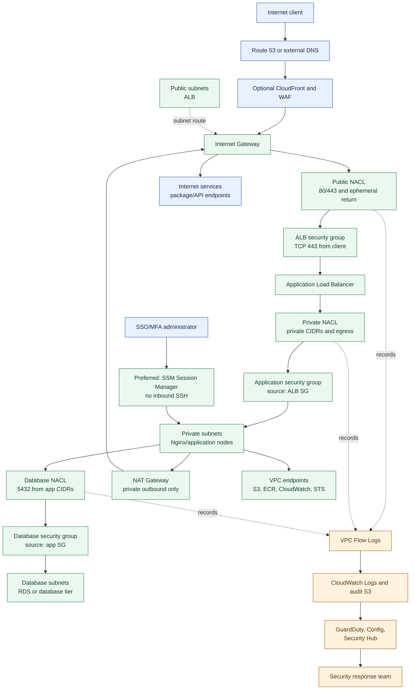

# End-to-End Cloud Network Flow

This vertical diagram describes the intended AWS network path for an internet-facing application from top to bottom. The security baseline manages the VPC flow logs, security groups, NACLs, encryption, and detection services shown with a solid border. The VPC, routes, load balancer, NAT gateway, endpoints, and workloads are existing or separately managed infrastructure.

## Flow 1: inbound HTTPS

1. DNS resolves the application name to the optional edge layer or the ALB.
2. The internet gateway routes traffic to the public subnets.
3. The public NACL permits only the required listener ports and return ephemeral traffic.
4. The ALB security group permits TCP 443 from approved client ranges.
5. The ALB forwards to private application targets.
6. The application security group permits traffic only from the ALB security group.
7. Readiness checks must pass before a target receives traffic.

## Flow 2: private application to database

1. The application sends database traffic through the private subnet route.
2. The private NACL permits the declared private CIDR and required return ports.
3. The database security group permits TCP 5432 only from the application security group.
4. The database NACL permits TCP 5432 only from declared application CIDRs and allows the stateless return path.
5. No public route, public IP, or internet security-group source is required for the database.

## Flow 3: private outbound traffic

1. Workloads use VPC endpoints for AWS services whenever supported.
2. Other outbound traffic uses a NAT gateway in a public subnet.
3. The NAT gateway reaches the internet through the internet gateway; unsolicited inbound traffic cannot use the NAT path to reach private workloads.
4. Private NACLs and security groups must allow DNS, HTTPS, endpoint traffic, and ephemeral return ports required by the workload.

## Flow 4: administration and evidence

1. Administrators authenticate with SSO and MFA.
2. Prefer SSM Session Manager over inbound SSH. No SSH ingress is created by this baseline.
3. NACL traffic is captured by VPC Flow Logs and delivered to CloudWatch Logs and the audit bucket.
4. GuardDuty, AWS Config, and Security Hub evaluate activity and findings are routed to the response team.

## Required review before deployment

- Confirm route tables, internet gateway, NAT gateway, and VPC endpoint policies.
- Confirm public/private/database subnet CIDRs match `terraform.tfvars`.
- Confirm NACL return traffic for DNS, HTTPS, NAT, endpoints, and database sessions.
- Confirm the ALB target health check path and application listener port.
- Confirm database encryption, backups, deletion protection, and multi-AZ settings in the database stack.
- Confirm flow-log and security-finding delivery to an independent security account where required.