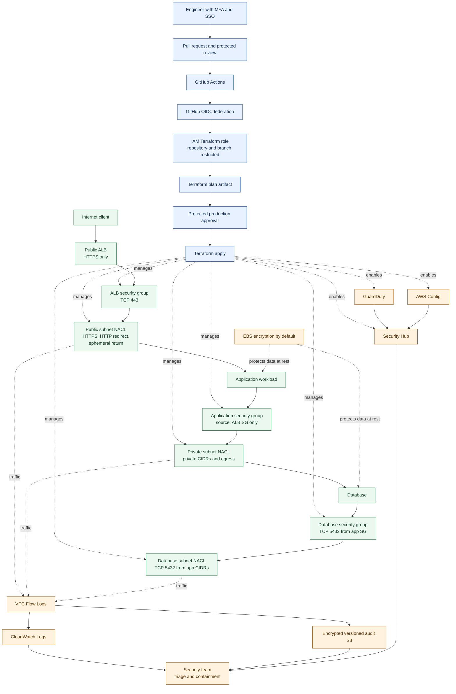

# End-to-End Security Architecture

This diagram shows how identity, deployment, network enforcement, encryption, logging, detection, and response work together. The Terraform in this repository protects an existing VPC; it does not create the VPC or workload compute. ALB, application, and database security groups use the pinned public `terraform-aws-modules/security-group/aws` module; NACLs remain local resources.

## Request path

1. A client reaches the ALB over HTTPS.
2. The ALB security group permits TCP 443 from the internet. No SSH rule is created.
3. The public NACL permits the required listener and return traffic.
4. The application security group permits traffic only from the ALB security group.
5. The private NACL limits subnet traffic and egress paths.
6. The database security group permits PostgreSQL only from the application security group.
7. The database NACL additionally permits PostgreSQL only from declared private application CIDRs.

Security groups are stateful. NACLs are stateless, so both request and return paths must be explicitly allowed.

## Control and evidence path

1. GitHub Actions authenticates through OIDC; no long-lived AWS key is required.
2. Terraform creates a plan artifact before apply.
3. A protected production environment requires approval before the exact plan is applied.
4. EBS, S3 audit storage, and Terraform state use encryption controls.
5. VPC Flow Logs and CloudWatch preserve network evidence.
6. GuardDuty and Config findings feed Security Hub.
7. The security team triages findings and uses temporary, tracked containment rules before permanent Terraform remediation.

## Failure boundaries

- A missing readiness or health signal must stop an application rollout.
- A failed Terraform plan must block apply.
- A missing production approval must block apply.
- A NACL rule change must be tested for DNS, VPC endpoints, NAT return traffic, and application health before production.
- Findings and logs must be retained outside the workload account when organizational controls require independent evidence.